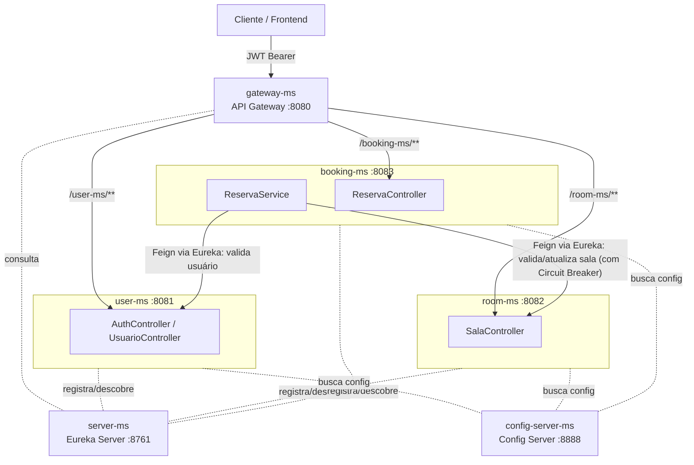
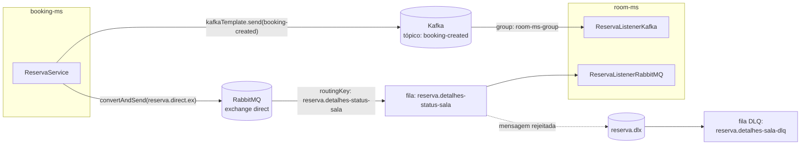

# Room Reservation API — Microservices

Evolução do projeto [room-reservation-api](https://github.com/jhohannessf/room-reservation-api) (originalmente um monolito) para uma **arquitetura de microsserviços**, com **Service Discovery (Eureka)**, **API Gateway**, **configuração centralizada (Spring Cloud Config)**, **resiliência com Circuit Breaker**, comunicação síncrona via **OpenFeign**, **mensageria assíncrona (Kafka e RabbitMQ)**, autenticação **stateless com JWT**, **login social (Google e GitHub)** e **autenticação de dois fatores (2FA)** por e-mail ou aplicativo autenticador (TOTP).

> 📌 Este repositório é a continuação do projeto monolítico citado acima. Aqui a mesma regra de negócio (gestão de usuários, salas e reservas) foi redesenhada como um sistema distribuído.

## Sumário

- [Arquitetura](#arquitetura)
- [Stack técnica](#stack-técnica)
- [Estrutura do repositório](#estrutura-do-repositório)
- [Segurança](#segurança)
- [Resiliência](#resiliência)
- [Mensageria](#mensageria)
- [Serviços e endpoints](#serviços-e-endpoints)
- [Modelagem de dados](#modelagem-de-dados)
- [Como rodar o projeto](#como-rodar-o-projeto)
- [Roadmap](#roadmap)

## Arquitetura

O sistema é composto por 6 aplicações Spring Boot: três microsserviços de negócio (cada um com seu próprio banco de dados, padrão *Database per Service*), um servidor de descoberta de serviços, um servidor de configuração centralizada e um API Gateway como porta de entrada única. Além deles, o `docker-compose.yml` também sobe a infraestrutura de mensageria (RabbitMQ e Kafka) usada por `booking-ms` e `room-ms` — ver seção [Mensageria](#mensageria).

| Serviço | Responsabilidade | Porta |
|---|---|---|
| `server-ms` | Eureka Server — registro e descoberta de serviços | `8761` (fixa) |
| `config-server-ms` | Spring Cloud Config Server — configuração centralizada dos serviços de negócio | `8888` (fixa) |
| `gateway-ms` | API Gateway — ponto único de entrada, roteamento dinâmico via Eureka | `8080` (fixa) |
| `user-ms` | Cadastro de usuários, autenticação, login social, 2FA | dinâmica (`server.port=0`) |
| `room-ms` | Cadastro e controle de status das salas, consumidor Kafka/RabbitMQ | dinâmica (`server.port=0`) |
| `booking-ms` | Regras de reserva, orquestração via Feign, resiliência com Circuit Breaker, produtor Kafka/RabbitMQ | dinâmica (`server.port=0`) |

> Os três serviços de negócio usam `server.port=0`: o Spring Boot pede uma porta livre ao sistema operacional a cada subida, e cada instância se registra no Eureka com um `instance-id` único (`${spring.application.name}:${random.int}`). Isso permite subir **mais de uma instância do mesmo serviço** (ex: dois `room-ms` em paralelo) sem conflito de porta, com o `gateway-ms` e os `@FeignClient` fazendo *load balancing* entre elas via Eureka — o cliente nunca precisa saber a porta real, só acessa tudo por `http://localhost:8080/<nome-do-serviço>/...`.



Como funciona na prática:

- **`server-ms`** é o Eureka Server: cada um dos outros serviços se registra nele ao subir, e é através dele que se descobrem uns aos outros (em vez de URLs fixas).
- **`config-server-ms`** centraliza o `application.properties` de `user-ms`, `room-ms` e `booking-ms` — em vez de cada um carregar sua própria configuração local, eles importam de `http://localhost:8888` na inicialização (`spring.config.import=optional:configserver:...`). Os arquivos de configuração reais ficam empacotados no classpath do próprio Config Server, em `config-server-ms/src/main/resources/config-repo/` — uma escolha deliberada para não depender de um caminho absoluto no disco (ver [Roadmap](#roadmap) para o histórico dessa decisão).

  **Por que centralizar configuração?** Antes dele, cada serviço tinha seu próprio `application.properties` completo (URL do banco, chave JWT, credenciais de e-mail etc.), espalhados em arquivos diferentes. Numa arquitetura de microsserviços de verdade, isso vira um problema de escala: imagine ter várias instâncias de `user-ms` rodando e precisar mudar um único valor — sem Config Server, seria necessário alterar e reiniciar cada instância manualmente. Com a configuração centralizada, a mudança é feita em um único lugar (`config-repo/user-ms.properties`), e qualquer instância que reiniciar já busca o valor atualizado — a fonte da verdade da configuração fica desacoplada do deploy de cada serviço.

  Neste projeto ele roda no **modo "native"**, lendo arquivos `.properties` locais (empacotados no próprio jar) em vez de buscar de um repositório Git remoto, que é o modo mais comum em produção — uma simplificação razoável para fins de portfólio, que ainda demonstra o entendimento do conceito de configuração centralizada sem exigir manter um repositório Git separado só para isso.
- **`gateway-ms`** é o único serviço com porta exposta que faz sentido o cliente conhecer. Ele recebe a requisição, olha o prefixo do path (`/user-ms/**`, `/room-ms/**` ou `/booking-ms/**`), remove esse prefixo (`StripPrefix=1`) e encaminha para uma instância saudável do serviço correspondente, resolvida dinamicamente via Eureka (`lb://user-ms`, por exemplo).
- **`booking-ms`** continua sendo o orquestrador da regra de negócio: antes de confirmar uma reserva, ele consulta `user-ms` e `room-ms` via **Feign Clients**, resolvidos via Eureka. Essas chamadas são protegidas por **Circuit Breaker** (ver seção [Resiliência](#resiliência)); paralelamente, ele também publica eventos assíncronos para `room-ms` via **Kafka** e **RabbitMQ** (ver seção [Mensageria](#mensageria)).
- Assim como antes, cada serviço valida o JWT **localmente**, sem precisar chamar `user-ms` a cada requisição — os serviços compartilham a mesma chave secreta (`jwt.key`).
- Como `user-ms`, `room-ms` e `booking-ms` rodam em porta dinâmica, o endpoint `GET /api/v1/reservas/porta` existe justamente para comprovar o *load balancing* na prática: ele devolve a porta local (`${local.server.port}`) da instância de `booking-ms` que respondeu — útil para chamar repetidamente e ver a porta mudar entre instâncias diferentes.

## Stack técnica

- **Java 21** + **Spring Boot** (multi-módulo Maven, com um `pom.xml` raiz agregando os 6 serviços)
- **Spring Cloud Netflix Eureka** — service discovery (server e client)
- **Spring Cloud Config** — configuração centralizada (modo *native*, lendo do classpath)
- **Spring Cloud Gateway (MVC)** — API Gateway com roteamento declarativo
- **Spring Cloud OpenFeign** + **Spring Cloud LoadBalancer** — comunicação HTTP síncrona entre `booking-ms` e os demais serviços, com resolução de endereço via Eureka
- **Resilience4j (Spring Cloud Circuit Breaker)** — tolerância a falhas nas chamadas Feign de `booking-ms`
- **Spring `@Scheduled`** — job de reconciliação para reservas pendentes de integração
- **Apache Kafka (Spring Kafka)** — mensageria assíncrona orientada a evento (`booking-created`), com DTOs próprios por serviço
- **RabbitMQ (Spring AMQP)** — mensageria com exchanges/filas/DLQ para notificação de mudança de status de sala
- **Spring Data JPA / Hibernate** — persistência
- **Flyway** — versionamento de schema (MySQL)
- **Spring Security** — autenticação e autorização
- **JJWT + Auth0 java-jwt** — geração e validação de JWT
- **Spring Security OAuth2 Client** — login social (Google e GitHub)
- **GoogleAuth (warrenstrange)** — geração/validação de códigos TOTP (Google Authenticator)
- **Spring Mail** — envio de código de 2FA por e-mail
- **MySQL** — um banco por serviço de negócio
- **Docker Compose** — sobe os 6 serviços de aplicação + MySQL + RabbitMQ + Kafka + Kafka UI com um único comando
- **Bean Validation (Jakarta Validation)**

## Estrutura do repositório

Monorepo multi-módulo: um `pom.xml` raiz agrega os 6 serviços, cada um com seu próprio `pom.xml`, `Dockerfile` e ciclo de vida independente.

```
room-reservation-microservices/
├── pom.xml                        # POM agregador (packaging pom)
├── docker-compose.yml             # app services + MySQL + RabbitMQ + Kafka + Kafka UI
├── .env.example
├── server-ms/                     # Eureka Server
│   └── Dockerfile
├── config-server-ms/              # Config Server
│   ├── Dockerfile
│   └── src/main/resources/config-repo/   # .properties centralizados (classpath)
├── gateway-ms/                    # API Gateway
│   └── Dockerfile
├── user-ms/                       # autenticação, usuários, perfis, 2FA
│   └── Dockerfile
├── room-ms/                       # salas — consumidor Kafka/RabbitMQ
│   ├── Dockerfile
│   └── src/main/java/.../messaging/
│       ├── kafka/                 # ReservaListenerKafka
│       └── rabbitmq/              # RabbitMQConfig, ReservaListenerRabbitMQ
├── booking-ms/                    # reservas — orquestra user-ms + room-ms via Feign (Circuit Breaker) e publica eventos
│   ├── Dockerfile
│   └── src/main/java/.../messaging/
│       ├── kafka/                 # KafkaConfig (tópico booking-created)
│       └── rabbitmq/              # RabbitMQConfig
└── README.md
```

## Segurança

O ponto forte do projeto está na camada de segurança do `user-ms`, replicada de forma simplificada (apenas validação) em `room-ms` e `booking-ms`. O `gateway-ms`, por ora, só roteia — a validação do JWT continua acontecendo em cada serviço de destino, não no gateway.

### Autenticação local (e-mail/senha)

- Senha armazenada com hash **BCrypt**.
- `POST /api/v1/auth/registrar` cria o usuário com o perfil padrão `ESTUDANTE`.
- `POST /api/v1/auth/login` autentica via `AuthenticationManager` e:
  - se o usuário **não tem 2FA ativa**, já retorna o JWT;
  - se tem, retorna uma resposta sinalizando que é necessário confirmar o segundo fator (sem token ainda).

### Login social (OAuth2 — Google e GitHub)

- Fluxo padrão do Spring Security OAuth2 Client (`/oauth2/authorization/google` e `/oauth2/authorization/github`).
- Um `OAuth2LoginSuccessHandler` customizado intercepta o sucesso do login:
  1. identifica o provedor (`google` ou `github`);
  2. extrai nome e e-mail (no GitHub, o e-mail primário/verificado é buscado via chamada à API do GitHub, já que nem sempre vem nos atributos do OAuth2User);
  3. busca o usuário pelo e-mail ou cria um novo, com senha aleatória e perfil `ESTUDANTE`;
  4. gera o **mesmo JWT** usado no login local e devolve ao cliente.

Isso significa que, depois do login social, o restante do sistema (roles, 2FA, autorização) funciona exatamente igual a um login local — o provedor de login (`LOCAL`, `GOOGLE`, `GITHUB`) fica registrado no usuário só para fins de auditoria.

### Autenticação de dois fatores (2FA)

Suporta dois tipos, com o mesmo contrato de resposta (`TipoA2f`: `DESATIVADA`, `EMAIL`, `AUTHENTICATOR`):

- **Por e-mail**: no login, gera um código numérico de 6 dígitos com expiração de 5 minutos e envia por e-mail (SMTP Gmail). O código é de uso único (`utilizado = true` após validado).
- **Por aplicativo autenticador (TOTP / RFC 6238)**: fluxo de ativação em duas etapas —
  1. `POST /api/v1/auth/2fa/totp/setup` gera um secret e devolve uma URL de QR Code para escanear no Google Authenticator (ou similar);
  2. `POST /api/v1/auth/2fa/totp/confirm` confirma o primeiro código gerado pelo app antes de ativar a 2FA de fato.

Depois de ativada, todo login exige uma segunda chamada a `POST /api/v1/auth/2fa/verify` (com e-mail + código) para só então receber o JWT.

### Autorização (roles e hierarquia)

- Perfis: `ESTUDANTE`, `INSTRUTOR`, `MODERADOR`, `ADMINISTRADOR`.
- Hierarquia de roles configurada via `RoleHierarchy`: `ADMINISTRADOR` implica `MODERADOR`, que implica `ESTUDANTE` e `INSTRUTOR`.
- Autorização feita tanto na cadeia de filtros (`SecurityFilterChain`) quanto em nível de método (`@PreAuthorize`), incluindo regras de dono do recurso (ex: `#id == authentication.principal.id or hasRole('ADMINISTRADOR')` para um usuário poder editar os próprios dados ou um admin poder editar qualquer um).

### JWT stateless e distribuído

- Token assinado com HMAC (chave `jwt.key`, compartilhada por todos os serviços de negócio via variável de ambiente).
- Claims incluem `usuarioId` e `authorities` (perfis), então `room-ms` e `booking-ms` conseguem autenticar e autorizar a requisição **sem consultar o `user-ms`**, só decodificando o token.
- Sessão stateless (`SessionCreationPolicy.STATELESS`), sem cookies de sessão.
- `booking-ms` propaga o JWT recebido do cliente para as chamadas Feign a `room-ms`/`user-ms` através de um `RequestInterceptor`, preservando o contexto de segurança entre serviços — a resolução de qual instância chamar é feita pelo Eureka, não por uma URL fixa.

## Resiliência

`booking-ms` depende de `room-ms` para validar e atualizar o status de uma sala a cada reserva — se `room-ms` cair, isso não pode travar o sistema inteiro. Por isso, essa chamada é protegida com **Resilience4j Circuit Breaker** (instância `atualizaSala`), com um fluxo de degradação controlada em vez de simplesmente falhar. A proteção existe em dois pontos:

1. **Ao criar a reserva** (`POST /api/v1/reservas`), o `booking-ms` tenta marcar a sala como `OCUPADA` no `room-ms` através de `SalaIntegracaoService.marcarSalaOcupada`, anotado com `@CircuitBreaker(name = "atualizaSala", fallbackMethod = "marcarSalaOcupadaFallback")`. Se `room-ms` estiver indisponível, o fallback retorna `false` e a reserva é salva com status **`ATIVA_SEM_INTEGRACAO`** em vez de ser perdida ou rejeitada.
2. **Ao confirmar uma reserva pendente** (`PATCH /api/v1/reservas/{id}`), a mesma anotação `@CircuitBreaker(name = "atualizaSala", ...)` fica diretamente no método do `ReservaController`: se `room-ms` continuar fora do ar, o fallback (`salaAtualizadaComIntegracaoPendente`) mantém a reserva marcada como pendente; se já tiver voltado, a reserva é promovida para `ATIVA`.
3. Um job agendado (`@Scheduled(fixedDelay = 60000)`, rodando a cada 1 minuto) varre periodicamente as reservas em `ATIVA_SEM_INTEGRACAO` e tenta reconciliar: se `room-ms` já voltou, a reserva é promovida para `ATIVA` e a sala é marcada como `OCUPADA`; se ainda estiver fora do ar, tenta de novo no próximo ciclo.

**Por que o Circuit Breaker precisou de uma classe separada (`SalaIntegracaoService`)?** O Resilience4j (assim como qualquer AOP do Spring) funciona interceptando a chamada a um método anotado *a partir de outro bean*. Se a chamada anotada estivesse dentro do próprio `ReservaService` e fosse invocada como `this.marcarSalaOcupada(...)`, a anotação seria **silenciosamente ignorada** — o Spring nunca passa pelo proxy nesse caso de auto-invocação. Por isso essa chamada específica foi extraída para um bean próprio, injetado no `ReservaService`. No `ReservaController`, isso não é necessário porque o método já é chamado de fora (pelo Spring MVC via HTTP), então o proxy entra em ação normalmente.

Como consequência dessa separação por método, o circuit breaker automático do OpenFeign foi **desligado** (`spring.cloud.openfeign.circuitbreaker.enabled=false`): ele protegeria *todas* as chamadas Feign indiscriminadamente — inclusive as de validação (`buscarPorId` de sala e usuário), que precisam propagar o erro real (404, 403 etc.) em vez de cair num fallback genérico. Manter o Resilience4j só nos métodos anotados explicitamente dá controle fino sobre onde a degradação é aceitável.

Esse padrão — aceitar uma escrita em estado degradado e reconciliar depois — é uma forma simples de **consistência eventual**, e é um bom talking point de entrevista: mostra entendimento de que, em sistemas distribuídos, "a chamada falhou" nem sempre deveria significar "a operação inteira falhou".

## Mensageria

Além da comunicação síncrona via Feign, `booking-ms` e `room-ms` trocam mensagens assíncronas por **dois brokers diferentes**, cada um usado para um propósito distinto — uma escolha deliberada para demonstrar os dois modelos na prática:



### Kafka — evento de reserva criada

- **Tópico**: `booking-created` (2 partições, réplica 1, retenção de 7 dias, `cleanup.policy=delete`), criado declarativamente por `KafkaConfig` (`NewTopic` bean) tanto em `booking-ms` quanto em `room-ms`.
- **Producer**: ao cadastrar uma reserva (`ReservaService.cadastrar`), `booking-ms` publica o `ReservaRequest` no tópico via `KafkaTemplate<String, ReservaRequest>`.
- **Consumer**: `room-ms` consome com `@KafkaListener(topics = "booking-created", groupId = "room-ms-group")` (`ReservaListenerKafka`), hoje apenas logando os detalhes da reserva recebida — um ponto de partida para uma futura ação real (ex: atualizar um cache de disponibilidade).
- **DTOs próprios por serviço**: cada serviço tem sua própria classe `ReservaRequest` (pacotes distintos, sem dependência de compilação entre os serviços). Isso só funciona porque o header de tipo do Jackson é desativado dos dois lados (`spring.json.add.type.headers=false` no producer, `spring.json.use.type.headers=false` no consumer) e o consumer aponta explicitamente para sua própria classe (`spring.json.value.default.type`) — sem isso, o `JsonDeserializer` tentaria instanciar a classe do producer, que não existe no classpath do `room-ms`.

### RabbitMQ — notificação de status de sala

- **Exchange**: `reserva.direct.ex` (direct), routing key `reserva.detalhes-status-sala`.
- **Fila**: `reserva.detalhes-status-sala`, com Dead Letter Exchange configurado (`reserva.dlx` → fila `reserva.detalhes-sala-dlq`) para mensagens rejeitadas.
- **Producer**: `booking-ms` publica o enum `StatusSala` ao reconciliar manualmente uma reserva pendente (`ReservaService.confirmarReservaSemIntegracao`), via `RabbitTemplate.convertAndSend`.
- **Consumer**: `room-ms` consome com `@RabbitListener(queues = "reserva.detalhes-status-sala")` (`ReservaListenerRabbitMQ`), hoje também apenas logando o status recebido.
- **Retry**: configurado via `spring.rabbitmq.listener.simple.retry.*` (4 tentativas, intervalo inicial de 5s) antes de uma mensagem ser considerada falha.
- Existem ainda uma exchange fanout (`reserva.fanout.ex`) e uma fila (`reserva.detalhes-sala`) já provisionadas no `RabbitMQConfig`, remanescentes de uma primeira versão do fluxo de "reserva criada" — esse fluxo foi migrado para o Kafka (ver acima) e o publish correspondente está comentado em `ReservaService`, mas a infraestrutura RabbitMQ ainda existe no código.

### Por que dois brokers?

Não é redundância — cada um ilustra um modelo diferente de mensageria, de propósito:

| | Kafka | RabbitMQ |
|---|---|---|
| Modelo | Log distribuído, com replay dentro da retenção | Fila ponto-a-ponto/roteamento (mensagem sai da fila ao ser confirmada) |
| Usado aqui para | Evento de domínio (`reserva criada`) — histórico, múltiplos consumidores possíveis | Notificação pontual de mudança de estado, com DLQ para falhas |
| Painel de administração | Não nativo — usamos **Kafka UI** (`http://localhost:8085`) | Nativo (`http://localhost:15672`) |

## Serviços e endpoints

Todas as rotas abaixo passam pelo `gateway-ms` (porta `8080`), prefixadas pelo nome do serviço — o gateway remove esse prefixo antes de encaminhar (`StripPrefix=1`). Ex: `POST http://localhost:8080/user-ms/api/v1/auth/login` chega em `user-ms` como `POST /api/v1/auth/login`.

### `user-ms` (prefixo `/user-ms`)

| Método | Rota | Descrição | Acesso |
|---|---|---|---|
| POST | `/api/v1/auth/registrar` | Cadastro de usuário | Público |
| POST | `/api/v1/auth/login` | Login local | Público |
| POST | `/api/v1/auth/2fa/verify` | Confirma código 2FA (e-mail ou TOTP) e emite o JWT | Público |
| POST | `/api/v1/auth/2fa/totp/setup` | Gera secret + QR Code para ativar TOTP | Autenticado |
| POST | `/api/v1/auth/2fa/totp/confirm` | Confirma o primeiro código TOTP e ativa a 2FA | Autenticado |
| GET | `/oauth2/authorization/google` \| `/github` | Início do login social | Público |
| POST | `/api/v1/auth/logout` | Logout stateless (no-op — sem sessão para invalidar no servidor; a invalidação real é o cliente descartar o JWT) | Público |
| GET/POST/PUT/DELETE | `/api/v1/usuarios/**` | CRUD de usuários, perfis e ativação de 2FA por e-mail | Autenticado / dono do recurso / `ADMINISTRADOR` |

### `room-ms` (prefixo `/room-ms`)

| Método | Rota | Descrição | Acesso |
|---|---|---|---|
| GET | `/api/v1/salas` \| `/listar-paginado` \| `/{id}` | Consulta de salas | Público |
| POST | `/api/v1/salas` | Cadastro de sala | `ADMINISTRADOR` |
| PUT | `/api/v1/salas/{id}` | Atualização completa da sala | `ADMINISTRADOR` |
| DELETE | `/api/v1/salas/{id}` | Remoção de sala | `ADMINISTRADOR` |
| PATCH | `/api/v1/salas/alterar-status/{id}` | Altera apenas o status (LIVRE/OCUPADA) | Autenticado |

### `booking-ms` (prefixo `/booking-ms`)

| Método | Rota | Descrição | Acesso |
|---|---|---|---|
| GET | `/api/v1/reservas` \| `/listar-paginado` \| `/sala/{id}` \| `/{id}` | Consulta de reservas | Autenticado |
| POST | `/api/v1/reservas` | Cria reserva (valida usuário e sala via Feign, conflito de horário, capacidade, horário de funcionamento; publica evento no Kafka) | Autenticado |
| PUT | `/api/v1/reservas/{id}` | Atualiza reserva (apenas o dono) | Autenticado |
| DELETE | `/api/v1/reservas/{id}` | Cancela reserva (apenas o dono) | Autenticado |
| PATCH | `/api/v1/reservas/{id}` | Confirma reserva; se `room-ms` estiver fora do ar, aciona o Circuit Breaker e marca como `ATIVA_SEM_INTEGRACAO`; se resolvida, publica status no RabbitMQ | Autenticado |
| GET | `/api/v1/reservas/porta` | Retorna a porta local da instância que respondeu — usado para demonstrar o *load balancing* entre múltiplas instâncias | Público |

### Painéis

- Eureka: `http://localhost:8761`
- Config Server (para inspecionar a config resolvida de um serviço): `http://localhost:8888/{nome-do-serviço}/default`, ex: `http://localhost:8888/user-ms/default`
- RabbitMQ Management: `http://localhost:15672` (usuário/senha definidos em `RABBITMQ_DEFAULT_USER`/`RABBITMQ_DEFAULT_PASS`)
- Kafka UI (painel visual do Kafka, sem equivalente nativo): `http://localhost:8085`

## Modelagem de dados

Cada serviço de negócio versiona seu próprio schema via Flyway:

- **user-ms**: `usuarios`, `perfis`, `usuarios_perfis` (N:N), `codigos_a2f` — com colunas incrementais para `provedor_login`, `tipo_a2f`, `a2f_ativa` e `a2f_secret`, adicionadas em migrations sucessivas conforme o recurso evoluiu.
- **room-ms**: `salas` (com constraint de capacidade positiva), com status `LIVRE`, `OCUPADA` ou `OCUPADA_SEM_INTEGRACAO`.
- **booking-ms**: `reservas` (referencia `usuario_id` e `sala_id` por chave lógica, não por FK física), com status `ATIVA`, `CANCELADA` ou `ATIVA_SEM_INTEGRACAO`.

## Como rodar o projeto

### Pré-requisitos

- Docker e Docker Compose (recomendado) **ou** Java 21 + MySQL 8+ + RabbitMQ + Kafka para rodar manualmente
- Contas OAuth2 configuradas no Google Cloud Console e no GitHub Developer Settings (para o login social)
- Uma conta de e-mail com senha de app (para o envio do código de 2FA por e-mail)

### Opção A — Docker Compose (recomendado)

1. Copie `.env.example` para `.env` e preencha os valores (senha do MySQL, `JWT_KEY`, credenciais de e-mail, OAuth2 e RabbitMQ — lembre-se de usar aspas se algum valor tiver `#` ou `$`).
2. Suba tudo com um único comando:

```bash
docker compose up --build
```

Isso builda as 6 imagens de aplicação e sobe MySQL, RabbitMQ, Kafka e Kafka UI — 10 containers no total —, com cada serviço de negócio criando seu próprio schema (`user_ms`, `room_ms`, `booking_ms`) automaticamente na primeira conexão. O Compose já cuida da ordem de subida (`room-ms` e `booking-ms` só sobem depois que o RabbitMQ e o Kafka reportam `healthy`) e da resolução de endereços entre containers (Eureka, Config Server, RabbitMQ e Kafka apontando para os nomes dos serviços, não para `localhost`).

> ⏱️ O Kafka em modo KRaft pode levar alguns segundos a mais para ficar pronto na primeira subida — se `room-ms`/`booking-ms` reiniciarem uma vez por causa disso, é esperado; o `restart: unless-stopped` cuida de tentar novamente.

Depois de tudo no ar, todas as chamadas do cliente são feitas em `http://localhost:8080/<nome-do-serviço>/...`.

### Opção B — Rodando cada serviço manualmente

Como os serviços dependem do Eureka para se descobrirem e do Config Server para sua configuração, a ordem de subida importa. Cada linha abaixo é um terminal separado. `room-ms` e `booking-ms` também precisam de um RabbitMQ e um Kafka acessíveis localmente (pode subir só esses dois pelo Compose com `docker compose up rabbitmq kafka` e rodar o restante manualmente).

**Linux, macOS ou Git Bash:**

```bash
# Terminal 1 — Eureka Server
cd server-ms && ./mvnw spring-boot:run

# Terminal 2 — Config Server
cd config-server-ms && ./mvnw spring-boot:run

# Terminal 3, 4, 5 — serviços de negócio (em qualquer ordem)
cd user-ms && ./mvnw spring-boot:run
cd room-ms && ./mvnw spring-boot:run
cd booking-ms && ./mvnw spring-boot:run

# Terminal 6 — Gateway (por último)
cd gateway-ms && ./mvnw spring-boot:run
```

**Windows (PowerShell):**

```powershell
# Terminal 1 — Eureka Server
cd server-ms; .\mvnw.cmd spring-boot:run

# Terminal 2 — Config Server
cd config-server-ms; .\mvnw.cmd spring-boot:run

# Terminal 3, 4, 5 — serviços de negócio (em qualquer ordem)
cd user-ms; .\mvnw.cmd spring-boot:run
cd room-ms; .\mvnw.cmd spring-boot:run
cd booking-ms; .\mvnw.cmd spring-boot:run

# Terminal 6 — Gateway (por último)
cd gateway-ms; .\mvnw.cmd spring-boot:run
```

**Windows (CMD):**

```cmd
cd server-ms && mvnw.cmd spring-boot:run
cd config-server-ms && mvnw.cmd spring-boot:run
cd user-ms && mvnw.cmd spring-boot:run
cd room-ms && mvnw.cmd spring-boot:run
cd booking-ms && mvnw.cmd spring-boot:run
cd gateway-ms && mvnw.cmd spring-boot:run
```

### Variáveis de ambiente

**user-ms:**
```
DATASOURCE_USERNAME=
DATASOURCE_PASSWORD=
JWT_KEY=
JWT_EXPIRATION=900000
EMAIL_USERNAME=
EMAIL_PASSWORD=
GOOGLE_CLIENT_ID=
GOOGLE_CLIENT_SECRET=
GITHUB_CLIENT_ID=
GITHUB_CLIENT_SECRET=
```

**room-ms** e **booking-ms:**
```
DATASOURCE_USERNAME=
DATASOURCE_PASSWORD=
JWT_KEY=
JWT_EXPIRATION=900000
RABBITMQ_DEFAULT_USER=
RABBITMQ_DEFAULT_PASS=
KAFKA_BOOTSTRAP_SERVERS=       # via Docker Compose já vem fixado como kafka:9092; só preencha rodando manualmente
```

**gateway-ms**, **server-ms** e **config-server-ms** não precisam de variáveis de ambiente para rodar localmente.

> ⚠️ `JWT_KEY` **precisa ser o mesmo valor em `user-ms`, `room-ms` e `booking-ms`** — é o que permite que cada um valide tokens emitidos pelo `user-ms` sem se comunicar entre si para isso.
>
> ⚠️ Nunca coloque valores reais de `.env` em um arquivo versionado no Git. Use sempre o `.env.example` como referência e mantenha o `.env` real fora do controle de versão (`.gitignore`).

## Roadmap

- [x] `docker-compose.yml` com os 6 serviços de aplicação + MySQL, portas corretas e resolução de Eureka/Config Server entre containers
- [x] Service Discovery (Eureka) em vez de URLs fixas nos `@FeignClient`
- [x] API Gateway (Spring Cloud Gateway) como ponto único de entrada
- [x] Centralizar configuração (Spring Cloud Config), com `search-locations` portável via classpath (em vez de caminho absoluto)
- [x] Circuit breaker (Resilience4j) nas chamadas Feign de `booking-ms`, com job de reconciliação
- [x] `SalaClient.alterarStatusSala` corrigido — hoje já chama o PATCH de status (`/alterar-status/{id}`), e não mais o PUT genérico
- [x] Corrigido o bug do Circuit Breaker não disparar na criação de reserva: a chamada foi movida para um bean dedicado (`SalaIntegracaoService`), evitando o problema de auto-invocação do proxy do Spring AOP
- [x] Portas dinâmicas (`server.port=0`) em `user-ms`, `room-ms` e `booking-ms`, permitindo múltiplas instâncias do mesmo serviço com *load balancing* via Eureka/Feign/Gateway
- [x] `docker-compose.yml` atualizado: removidos os mapeamentos fixos `8081:8081`, `8082:8082` e `8083:8083` de `user-ms`/`room-ms`/`booking-ms`, já obsoletos desde que esses serviços passaram a usar `server.port=0` — o acesso a eles já é só via `gateway-ms` (`8080`)
- [x] Integrar Kafka ao código: tópico `booking-created`, producer em `booking-ms`, consumer em `room-ms`, com DTOs próprios por serviço (sem header de tipo do Jackson)
- [x] Integrar RabbitMQ ao código: exchange direta + fila com DLQ para notificação de status de sala, com retry configurado
- [x] `docker-compose.yml` com RabbitMQ, Kafka (modo KRaft, sem Zookeeper) e Kafka UI provisionados e conectados a `room-ms`/`booking-ms`
- [ ] Dar uso real ao evento consumido em `room-ms` (Kafka e RabbitMQ) — hoje ambos os listeners só logam a mensagem recebida; próximo passo natural é atualizar um cache/projeção de disponibilidade de sala
- [ ] Testes de unidade e integração (JUnit 5 + Mockito) para os seis serviços
- [ ] Healthchecks via Spring Boot Actuator nos serviços de negócio, para o `docker-compose.yml` poder usar `service_healthy` em vez de `service_started` também entre os microsserviços (hoje já usado para RabbitMQ e Kafka)
- [ ] JWT validado no próprio `gateway-ms`, para rotas públicas x autenticadas serem decididas antes de chegar aos serviços de negócio
- [ ] Migrar o Config Server para modo Git-backed, se for necessário editar configuração sem rebuildar o serviço

---

Projeto com fins de estudo e portfólio, evoluindo o [room-reservation-api](https://github.com/jhohannessf/room-reservation-api) original de monolito para uma arquitetura de microsserviços com service discovery, configuração centralizada, API Gateway, resiliência e mensageria assíncrona.
