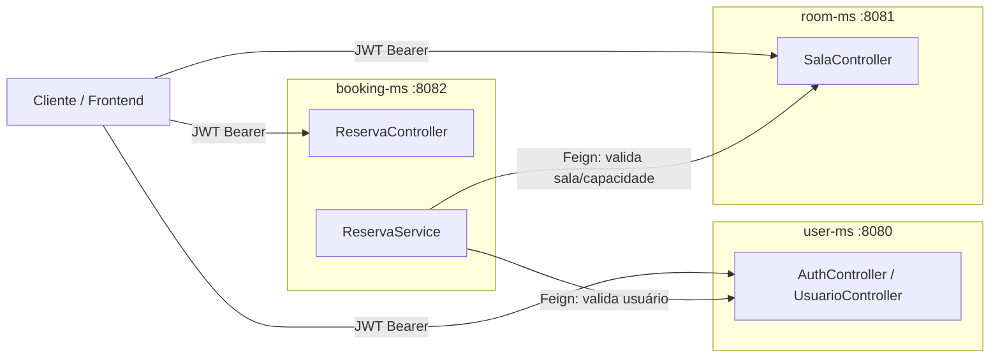

# Room Reservation API — Microservices

Evolução do projeto [room-reservation-api](https://github.com/jhohannessf/room-reservation-api) (originalmente um monolito) para uma **arquitetura de microsserviços**, com comunicação síncrona via **OpenFeign**, autenticação **stateless com JWT**, **login social (Google e GitHub)** e **autenticação de dois fatores (2FA)** por e-mail ou aplicativo autenticador (TOTP).

> 📌 Este repositório é a continuação do projeto monolítico citado acima. Aqui a mesma regra de negócio (gestão de usuários, salas e reservas) foi redesenhada como três serviços independentes.

## Sumário

- [Arquitetura](#arquitetura)
- [Stack técnica](#stack-técnica)
- [Estrutura do repositório](#estrutura-do-repositório)
- [Segurança](#segurança)
- [Serviços e endpoints](#serviços-e-endpoints)
- [Modelagem de dados](#modelagem-de-dados)
- [Como rodar o projeto](#como-rodar-o-projeto)
- [Roadmap](#roadmap)

## Arquitetura

O sistema é dividido em três microsserviços independentes, cada um com seu próprio banco de dados (padrão *Database per Service*):

| Serviço | Responsabilidade | Porta |
|---|---|---|
| `user-ms` | Cadastro de usuários, autenticação, login social, 2FA | `8080` |
| `room-ms` | Cadastro e controle de status das salas | `8081` |
| `booking-ms` | Regras de reserva (conflitos de horário, capacidade, orquestração via Feign) | `8082` |



`booking-ms` é o orquestrador da regra de negócio: antes de confirmar uma reserva, ele consulta `user-ms` (o usuário existe?) e `room-ms` (a sala existe, está livre e comporta a quantidade de pessoas?) via **Feign Clients**, e só então grava a reserva no seu próprio banco.

Cada serviço valida o JWT **localmente**, sem chamar `user-ms` a cada requisição — os três compartilham a mesma chave secreta (`jwt.key`), então basta decodificar e validar a assinatura do token para extrair usuário e perfis (roles). Isso evita que `user-ms` vire um gargalo/ponto único de falha para autenticação.

## Stack técnica

- **Java 21** + **Spring Boot**
- **Spring Data JPA / Hibernate** — persistência
- **Flyway** — versionamento de schema (MySQL)
- **Spring Security** — autenticação e autorização
- **JJWT + Auth0 java-jwt** — geração e validação de JWT
- **Spring Security OAuth2 Client** — login social (Google e GitHub)
- **GoogleAuth (warrenstrange)** — geração/validação de códigos TOTP (Google Authenticator)
- **Spring Cloud OpenFeign** — comunicação HTTP síncrona entre `booking-ms` e os demais serviços
- **Spring Mail** — envio de código de 2FA por e-mail
- **MySQL** — um banco por serviço
- **Bean Validation (Jakarta Validation)**

## Estrutura do repositório

Monorepo: cada microsserviço é um módulo Maven independente, com seu próprio `pom.xml`, mas todos versionados neste único repositório para facilitar a visão geral do sistema.

```
room-reservation-microservices/
├── user-ms/       # autenticação, usuários, perfis, 2FA
├── room-ms/       # salas
├── booking-ms/    # reservas (orquestra user-ms + room-ms via Feign)
└── README.md
```

## Segurança

O ponto forte do projeto está na camada de segurança do `user-ms`, replicada de forma simplificada (apenas validação) nos outros dois serviços.

### Autenticação local (e-mail/senha)

- Senha armazenada com hash **BCrypt**.
- `POST /api/v1/auth/registrar` cria o usuário com o perfil padrão `ESTUDANTE`.
- `POST /api/v1/auth/login` autentica via `AuthenticationManager` e:
  - se o usuário **não tem 2FA ativa**, já retorna o JWT;
  - se tem, retorna uma resposta sinalizando que é necessário confirmar o segundo fator (sem token ainda).

### Login social (OAuth2 — Google e GitHub)

- Fluxo padrão do Spring Security OAuth2 Client (`/oauth2/authorization/google` e `/oauth2/authorization/github`).
- Um `OAuth2LoginSuccessHandler` customizado intercepta o sucesso do login:
  1. identifica o provedor (`google` ou `github`);
  2. extrai nome e e-mail (no GitHub, o e-mail primário/verificado é buscado via chamada à API do GitHub, já que nem sempre vem nos atributos do OAuth2User);
  3. busca o usuário pelo e-mail ou cria um novo, com senha aleatória e perfil `ESTUDANTE`;
  4. gera o **mesmo JWT** usado no login local e devolve ao cliente.

Isso significa que, depois do login social, o restante do sistema (roles, 2FA, autorização) funciona exatamente igual a um login local — o provedor de login (`LOCAL`, `GOOGLE`, `GITHUB`) fica registrado no usuário só para fins de auditoria.

### Autenticação de dois fatores (2FA)

Suporta dois tipos, com o mesmo contrato de resposta (`TipoA2f`: `DESATIVADA`, `EMAIL`, `AUTHENTICATOR`):

- **Por e-mail**: no login, gera um código numérico de 6 dígitos com expiração de 5 minutos e envia por e-mail (SMTP Gmail). O código é de uso único (`utilizado = true` após validado).
- **Por aplicativo autenticador (TOTP / RFC 6238)**: fluxo de ativação em duas etapas —
  1. `POST /api/v1/auth/2fa/totp/setup` gera um secret e devolve uma URL de QR Code para escanear no Google Authenticator (ou similar);
  2. `POST /api/v1/auth/2fa/totp/confirm` confirma o primeiro código gerado pelo app antes de ativar a 2FA de fato.

Depois de ativada, todo login exige uma segunda chamada a `POST /api/v1/auth/2fa/verify` (com e-mail + código) para só então receber o JWT.

### Autorização (roles e hierarquia)

- Perfis: `ESTUDANTE`, `INSTRUTOR`, `MODERADOR`, `ADMINISTRADOR`.
- Hierarquia de roles configurada via `RoleHierarchy`: `ADMINISTRADOR` implica `MODERADOR`, que implica `ESTUDANTE` e `INSTRUTOR`.
- Autorização feita tanto na cadeia de filtros (`SecurityFilterChain`) quanto em nível de método (`@PreAuthorize`), incluindo regras de dono do recurso (ex: `#id == authentication.principal.id or hasRole('ADMINISTRADOR')` para um usuário poder editar os próprios dados ou um admin poder editar qualquer um).

### JWT stateless e distribuído

- Token assinado com HMAC (chave `jwt.key`, compartilhada pelos três serviços via variável de ambiente).
- Claims incluem `usuarioId` e `authorities` (perfis), então `room-ms` e `booking-ms` conseguem autenticar e autorizar a requisição **sem consultar o `user-ms`**, só decodificando o token.
- Sessão stateless (`SessionCreationPolicy.STATELESS`), sem cookies de sessão.
- `booking-ms` propaga o JWT recebido do cliente para as chamadas Feign a `room-ms`/`user-ms` através de um `RequestInterceptor`, preservando o contexto de segurança entre serviços.

## Serviços e endpoints

### `user-ms`

| Método | Rota | Descrição | Acesso |
|---|---|---|---|
| POST | `/api/v1/auth/registrar` | Cadastro de usuário | Público |
| POST | `/api/v1/auth/login` | Login local | Público |
| POST | `/api/v1/auth/2fa/verify` | Confirma código 2FA (e-mail ou TOTP) e emite o JWT | Público |
| POST | `/api/v1/auth/2fa/totp/setup` | Gera secret + QR Code para ativar TOTP | Autenticado |
| POST | `/api/v1/auth/2fa/totp/confirm` | Confirma o primeiro código TOTP e ativa a 2FA | Autenticado |
| GET | `/oauth2/authorization/google` \| `/github` | Início do login social | Público |
| GET/POST/PUT/DELETE | `/api/v1/usuarios/**` | CRUD de usuários, perfis e ativação de 2FA por e-mail | Autenticado / dono do recurso / `ADMINISTRADOR` |

### `room-ms`

| Método | Rota | Descrição | Acesso |
|---|---|---|---|
| GET | `/api/v1/salas` \| `/listar-paginado` \| `/{id}` | Consulta de salas | Público |
| POST / PUT / DELETE | `/api/v1/salas/**` | Cadastro, atualização e remoção de sala | `ADMINISTRADOR` |
| PATCH | `/api/v1/salas/alterar-status/{id}` | Altera status (LIVRE/OCUPADA) | Autenticado |

### `booking-ms`

| Método | Rota | Descrição | Acesso |
|---|---|---|---|
| GET | `/api/v1/reservas` \| `/listar-paginado` \| `/sala/{id}` \| `/{id}` | Consulta de reservas | Autenticado |
| POST | `/api/v1/reservas` | Cria reserva (valida usuário e sala via Feign, conflito de horário, capacidade, horário de funcionamento) | Autenticado |
| PUT | `/api/v1/reservas/{id}` | Atualiza reserva (apenas o dono) | Autenticado |
| DELETE | `/api/v1/reservas/{id}` | Cancela reserva (apenas o dono) | Autenticado |

## Modelagem de dados

Cada serviço versiona seu próprio schema via Flyway:

- **user-ms**: `usuarios`, `perfis`, `usuarios_perfis` (N:N), `codigos_a2f` — com colunas incrementais para `provedor_login`, `tipo_a2f`, `a2f_ativa` e `a2f_secret`, adicionadas em migrations sucessivas conforme o recurso evoluiu.
- **room-ms**: `salas` (com constraint de capacidade positiva).
- **booking-ms**: `reservas` (referencia `usuario_id` e `sala_id` por chave lógica, não por FK física — cada serviço só conhece seu próprio banco).

## Como rodar o projeto

### Pré-requisitos

- Java 21
- MySQL 8+ (um schema por serviço — os schemas são criados automaticamente pela flag `createDatabaseIfNotExist=true`)
- Contas OAuth2 configuradas no Google Cloud Console e no GitHub Developer Settings (para o login social)
- Uma conta de e-mail com senha de app (para o envio do código de 2FA por e-mail)

### Variáveis de ambiente (por serviço)

**user-ms:**
```
DATASOURCE_USERNAME=
DATASOURCE_PASSWORD=
JWT_KEY=
JWT_EXPIRATION=900000
EMAIL_USERNAME=
EMAIL_PASSWORD=
GOOGLE_CLIENT_ID=
GOOGLE_CLIENT_SECRET=
GITHUB_CLIENT_ID=
GITHUB_CLIENT_SECRET=
```

**room-ms** e **booking-ms:**
```
DATASOURCE_USERNAME=
DATASOURCE_PASSWORD=
JWT_KEY=
JWT_EXPIRATION=900000
```

> ⚠️ `JWT_KEY` **precisa ser o mesmo valor nos três serviços** — é o que permite que `room-ms` e `booking-ms` validem tokens emitidos pelo `user-ms` sem se comunicarem entre si para isso.

### Opção A — Docker Compose (recomendado)

1. Copie `.env.example` para `.env` e preencha os valores (senha do MySQL, `JWT_KEY`, credenciais de e-mail e OAuth2).
2. Suba tudo com um único comando:

```bash
docker compose up --build
```

Isso builda as 3 imagens (uma por serviço) e sobe um único MySQL compartilhado, cada serviço com seu próprio schema (`user_ms`, `room_ms`, `booking_ms`), criado automaticamente na primeira conexão.

### Opção B — Rodando cada serviço manualmente

```bash
# Terminal 1
cd user-ms && ./mvnw spring-boot:run

# Terminal 2
cd room-ms && ./mvnw spring-boot:run

# Terminal 3
cd booking-ms && ./mvnw spring-boot:run
```

## Roadmap

- [x] `docker-compose.yml` para subir os 3 serviços + MySQL com um único comando
- [ ] Testes de unidade e integração (JUnit 5 + Mockito) para os três serviços
- [ ] API Gateway (Spring Cloud Gateway) como ponto único de entrada
- [ ] Service Discovery (Eureka) em vez de URLs fixas nos `@FeignClient`
- [ ] Circuit breaker (Resilience4j) nas chamadas Feign de `booking-ms`
- [ ] Centralizar configuração (Spring Cloud Config)

---

Projeto com fins de estudo e portfólio, evoluindo o [room-reservation-api](https://github.com/jhohannessf/room-reservation-api) original de monolito para microsserviços.
